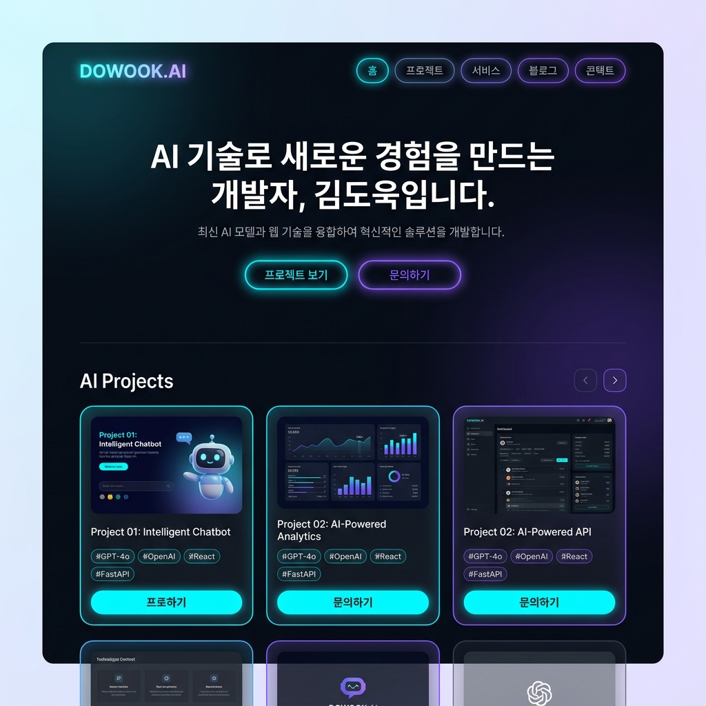

# 🎨 UI/UX 디자인 가이드라인 (Design System)



---

## 1. 디자인 시스템 개요 (Design System Overview)

본 문서는 **김도욱 개인 AI 프로젝트 포트폴리오 웹사이트** 구축을 위한 UI/UX 디자인 가이드라인입니다.  
20대 대학생 및 남성 개발자의 청량한 감성에 맞춰 **시원하고 상큼한 스카이블루 & 에메랄드 민트 그린 배경**, **귀여운 고양이(Cat) 캐릭터 아바타 및 발바닥 모션**, **완전 둥근 캡슐 UI**, **라이트 글래스모피즘(Light Glassmorphism)** 레이아웃을 핵심 콘셉트로 설정합니다.

---

## 2. 디자인 핵심 원칙 (Design Principles)

1. **Refreshing Mint Sky & Cute Cat (시원 상큼한 민트 스카이 & 고양이 테마)**
   - 쿨 민트 크림 화이트(#F4FAF8) 배경 위에 청량한 스카이블루(#38BDF8)와 에메랄드 민트 그린(#10B981) 파스텔 컬러 조합으로 시원시원하면서도 아기자기한 비주얼 구축.
2. **Playful Cat Character Integration (귀여운 고양이 캐릭터)**
   - AI 고양이 개발자 일러스트 캐릭터(DOWOOK CAT AI) 및 고양이 발바닥 이모지(`🐾`, `🐱`, `🐱‍💻`)를 주요 헤더, 히어로, 버튼, 뱃지에 바인딩.
3. **Bouncy Cat Paw Motion & Mint Glow (고양이 발바닥 바운스 모션)**
   - 정적인 화면을 벗어나 마우스 호버 시 실시간 민트 글로우 펄스(Soft Mint Glow)와 통통 튀는 고양이 발바닥 바운스 애니메이션을 통해 생동감 넘치는 UX 제공.
4. **Crisp Slate Readability (시원한 화이트 테마 가독성 극대화)**
   - 또렷한 딥 슬레이트 차콜(#0F172A)과 슬레이트 그레이(#475569) 텍스트 컬러의 조합으로 독보적인 visual hierarchy와 텍스트 가독성을 최우선 확보.

---

## 3. 파운데이션 시스템 (Foundations - CSS Variables)

프론트엔드 개발 시 즉시 `:root`에 등록하여 사용할 수 있는 디자인 토큰 정의입니다.

```css
:root {
  /* ==========================================
     1. Color Tokens (시원 상큼한 민트 스카이 팔레트)
     ========================================== */
  --bg-obsidian: #F4FAF8;        /* Main Light Mint Cream Background */
  --bg-surface-dark: #FFFFFF;     /* Pure White Card Base */
  --bg-glass-card: rgba(255, 255, 255, 0.88); /* Light Glass Base */
  --bg-glass-hover: rgba(240, 253, 250, 0.95);  /* Mint Ice Glass Hover */

  --border-glass: rgba(207, 250, 254, 0.9); /* Soft Sky Mint Border */
  --border-glass-bright: rgba(56, 189, 248, 0.5); /* Sky Blue Glow Border */

  /* Primary Accent: Refreshing Sky Blue */
  --color-primary: #38BDF8;
  --color-primary-glow: rgba(56, 189, 248, 0.35);

  /* Secondary Accent: Mint Emerald Green */
  --color-secondary: #10B981;
  --color-secondary-glow: rgba(16, 185, 129, 0.35);

  /* Text Colors */
  --text-main: #0F172A;        /* High Contrast Slate Charcoal Text */
  --text-muted: #475569;       /* Secondary Muted Text */
  --text-dim: #94A3B8;         /* Dim Placeholder Text */

  /* Gradients */
  --grad-primary: linear-gradient(135deg, #38BDF8 0%, #10B981 100%);
  --grad-primary-hover: linear-gradient(135deg, #0284C7 0%, #059669 100%);
  --grad-glass: linear-gradient(135deg, rgba(255, 255, 255, 0.95) 0%, rgba(240, 253, 250, 0.8) 100%);
  --grad-glow-beam: linear-gradient(90deg, #00F0FF, #8B5CF6, #00F0FF);

  /* ==========================================
     2. Typography Tokens (타이포그래피)
     ========================================== */
  --font-sans: 'Plus Jakarta Sans', -apple-system, BlinkMacSystemFont, sans-serif;
  --font-mono: 'JetBrains Mono', monospace;

  --fs-hero: 3.25rem;    /* 52px */
  --fs-h1: 2.25rem;      /* 36px */
  --fs-h2: 1.75rem;      /* 28px */
  --fs-h3: 1.25rem;      /* 20px */
  --fs-body-lg: 1.125rem;/* 18px */
  --fs-body-md: 1.00rem; /* 16px */
  --fs-body-sm: 0.875rem;/* 14px */
  --fs-caption: 0.75rem; /* 12px */

  /* ==========================================
     3. Border Radius Tokens (라운딩)
     ========================================== */
  --radius-pill: 9999px;   /* Buttons, Badges, Indicators */
  --radius-card: 24px;     /* Project & Bio Cards */
  --radius-input: 16px;    /* Forms & Search Input */
  --radius-sm: 8px;        /* Code blocks & Tooltips */

  /* ==========================================
     4. Elevation & Glow Shadows (그림자 및 빛 효과)
     ========================================== */
  --shadow-card: 0 20px 40px -15px rgba(0, 0, 0, 0.5);
  --shadow-neon-glow: 0 0 25px var(--color-primary-glow);
  --shadow-pulse: 0 0 35px var(--color-secondary-glow);

  /* ==========================================
     5. Transitions & Motion Timing
     ========================================== */
  --timing-fast: 150ms ease;
  --timing-normal: 250ms cubic-bezier(0.16, 1, 0.3, 1);
  --timing-bounce: 400ms cubic-bezier(0.34, 1.56, 0.64, 1);
}
```

---

## 4. 구조 및 레이아웃 가이드 (Grid & Spacing)

### 📐 컨테이너 규격
- **Desktop Max-Width**: `1200px` (중앙 정렬 `margin: 0 auto;`)
- **Tablet Gutter**: `32px`
- **Mobile Gutter**: `20px`

### 📏 여백 시스템 (8px Spacing Grid)
| 토큰명 | 크기 | 주요 용도 |
| :--- | :--- | :--- |
| `--space-xs` | 4px | 아이콘과 텍스트 간격 |
| `--space-sm` | 8px | 태그 뱃지 내부 패딩, 버튼 아이콘 간격 |
| `--space-md` | 16px | 카드 내부 간격, 컴포넌트 요소 사이 |
| `--space-lg` | 24px | 카드 간 격자 (Grid Gap), 섹션 소제목 간격 |
| `--space-xl` | 48px | 주요 컴포넌트 블록 간격 |
| `--space-xxl`| 96px | 메인 섹션 상하 여백 (`padding-top / bottom`) |

---

## 5. 컴포넌트 디자인 상세 규격 (Component Specifications)

### 5.1 버튼 시스템 (Pill-Shaped Button System)

모든 버튼은 **완전 둥근 캡슐형(Border Radius: 9999px)**으로 제작하여 터치와 클릭 시 미려한 마감감을 제공합니다.

#### 🔵 1) Primary Pill Button (주요 액션 버튼)
- **용도**: `[🚀 라이브 데모 바로가기]`, `[작업물 구경하기]`
- **배경**: `var(--grad-primary)` (Neon Cyan ➔ Electric Violet 그라디언트)
- **텍스트**: `#0B0F17` (Obsidian Black Bold / 가독성 최적화)
- **높이 & 패딩**: 
  - Large: `Height: 52px`, `Padding: 0 32px`, `Font-size: 16px (Weight: 700)`
  - Medium: `Height: 44px`, `Padding: 0 24px`, `Font-size: 14px (Weight: 700)`
- **인터랙션**: 
  - **Hover**: Y축 -3px 이동 (`transform: translateY(-3px)`), `var(--shadow-neon-glow)` 펄스 효과 발광.
  - **Active**: `transform: scale(0.97)` 크기 줄어듦.

```css
.btn-primary-pill {
  height: 52px;
  padding: 0 32px;
  border-radius: var(--radius-pill);
  background: var(--grad-primary);
  color: #0B0F17;
  font-weight: 700;
  font-family: var(--font-sans);
  border: none;
  cursor: pointer;
  box-shadow: 0 4px 20px var(--color-primary-glow);
  transition: all var(--timing-normal);
}

.btn-primary-pill:hover {
  transform: translateY(-3px);
  box-shadow: 0 8px 30px var(--color-primary-glow), 0 0 15px #00F0FF;
}
```

#### ⚪ 2) Secondary Glass Pill Button (보조 버튼)
- **용도**: `[💻 Github]`, `[연락하기]`
- **배경**: `var(--bg-glass-card)` + `backdrop-filter: blur(12px)`
- **테두리**: `1px solid var(--border-glass)`
- **텍스트**: `var(--text-main)` (`#F8FAFC`)
- **인터랙션**:
  - **Hover**: 테두리가 `var(--color-primary)`로 밝아지며 배경이 `rgba(0, 240, 255, 0.1)` 반투명 시안 채우기.

---

### 5.2 작업물 갤러리 카드 (Glassmorphism Project Card)

- **배경**: 반투명 옵시디언 다크 (`background: rgba(18, 24, 38, 0.65)`, `backdrop-filter: blur(16px)`)
- **테두리**: `1px solid rgba(255, 255, 255, 0.1)`
- **모서리**: `24px` 라운딩
- **패딩**: `24px`
- **구조**:
  1. **상단 썸네일 영역**: 16:9 비율 (Rounded 16px), 마우스 호버 시 이미지 1.05배 확대 (Zoom In).
  2. **AI 기술 태그 뱃지 모음**: 캡슐 태그 (Pill shape).
  3. **프로젝트 타이틀 & 설명**: `Plus Jakarta Sans` Bold 폰트 적용.
  4. **하단 액션 영역**: 데모 링크 & Github 버튼 배치.

```css
.project-card {
  background: var(--bg-glass-card);
  backdrop-filter: blur(16px);
  border: 1px solid var(--border-glass);
  border-radius: var(--radius-card);
  padding: 24px;
  transition: all var(--timing-normal);
  position: relative;
  overflow: hidden;
}

.project-card:hover {
  transform: translateY(-8px);
  border-color: var(--border-glass-bright);
  box-shadow: var(--shadow-card), 0 0 30px rgba(0, 240, 255, 0.15);
}
```

---

### 5.3 나만 편집 가능한 자기소개란 & 관리자 인증 모달

#### 🔒 관리자 인증 모달 UI
- **접근 방법**: 헤더 오른쪽 상단의 캡슐형 열쇠 아이콘(`🔑 Admin`) 클릭.
- **인증 폼 디자인**:
  - 비밀번호 입력창: 캡슐 형태 (`border-radius: 9999px`), 시안 네온 포커스 ring (`outline: 2px solid var(--color-primary)`).
  - PIN 암호 보안 표시: 숫자 입력 시 네온 도트 애니메이션 처리.

#### ✏️ 관리자 편집 모드 활성화 상태
- 편집 가능한 자기소개 영역 테두리에 **네온 펄스 애니메이션 보더 (Dashed/Glow)** 생성.
- 오른쪽 상단에 `[💾 저장하기]`, `[❌ 취소]` 캡슐 버튼 토글.

---

### 5.4 AI 기술 태그 & 뱃지 (Pill Tech Badges)

- **모양**: 캡슐형 (`border-radius: 9999px`)
- **크기**: `Height: 28px`, `Padding: 0 14px`, `Font-size: 12px (JetBrains Mono)`
- **스타일**:
  - AI 기술 태그 (예: `#GPT-4o`, `#OpenAI`): 시안 틴트 배경 (`background: rgba(0, 240, 255, 0.1)`, `color: #00F0FF`, `border: 1px solid rgba(0, 240, 255, 0.3)`)
  - 개발 스택 태그 (예: `#React`, `#Vite`): 바이올렛 틴트 배경 (`background: rgba(139, 92, 246, 0.1)`, `color: #A78BFA`, `border: 1px solid rgba(139, 92, 246, 0.3)`)

---

### 5.5 ✉️ 이메일 전송 연락폼 컴포넌트 (Glassmorphism Contact Form) ⭐ [신규 추가]

- **배경 카드**: 글래스모피즘 딥 다크 카드 (`background: var(--bg-glass-card)`, `backdrop-filter: blur(16px)`)
- **폼 레이아웃**:
  - Max-Width: `680px` 중앙 정렬
  - 라벨(`form-label`): 시안 틴트 아이콘과 `Plus Jakarta Sans` Bold (Font-size: `14px`, Color: `var(--text-main)`)
  - 입력 필드 (`form-input` / `textarea`): 
    - `background: rgba(11, 15, 23, 0.8)`
    - `border: 1px solid var(--border-glass)`
    - Focus 시: `border-color: var(--color-primary)`, `box-shadow: 0 0 15px var(--color-primary-glow)`
- **제출 버튼 (`btn-pill-primary`)**:
  - `[✉️ 이메일 보내기]` 전송 버튼 (Full width 또는 대형 캡슐 버튼)
  - 전송 중(Loading): `[⏳ 이메일 발송 중...]` 문구 변경 및 클릭 비활성화 (`disabled`, opacity 0.7)
- **피드백 알림 메시지**:
  - 성공: 시안/에메랄드 틴트 글로우 뱃지 (`🟢 메일이 성공적으로 전송되었습니다!`)
  - 실패: 로즈 틴트 글로우 뱃지 (`🔴 메일 전송 중 오류가 발생했습니다.`)

---

## 6. 마이크로 애니메이션 & 펄스 모션 (Micro-Interactions)

### 🎆 1) 네온 글로우 펄스 애니메이션 (Neon Glow Pulse)
히어로 섹션 및 대표 AI 프로젝트 카드의 테두리와 배경에 부드럽게 흐르는 빛 효과를 부여합니다.

```css
@keyframes neonPulse {
  0% {
    box-shadow: 0 0 15px rgba(0, 240, 255, 0.2), 0 0 30px rgba(139, 92, 246, 0.1);
  }
  50% {
    box-shadow: 0 0 30px rgba(0, 240, 255, 0.5), 0 0 50px rgba(139, 92, 246, 0.3);
  }
  100% {
    box-shadow: 0 0 15px rgba(0, 240, 255, 0.2), 0 0 30px rgba(139, 92, 246, 0.1);
  }
}

.pulse-glow-element {
  animation: neonPulse 3s infinite ease-in-out;
}
```

### 🌊 2) 그라디언트 테두리 빔 모션 (Gradient Border Beam)
관리자 모드 실행 또는 클릭 유도 요소에 적용되는 회전 빛 줄기 효과.

```css
@keyframes borderBeam {
  0% { background-position: 0% 50%; }
  50% { background-position: 100% 50%; }
  100% { background-position: 0% 50%; }
}

.animated-border-beam {
  background: var(--grad-glow-beam);
  background-size: 200% 200%;
  animation: borderBeam 4s linear infinite;
}
```

---

## 7. 반응형 디자인 스펙 (Responsive Breakpoints)

| 디바이스 | 해상도 범위 | 레이아웃 변형 규칙 |
| :--- | :--- | :--- |
| **Desktop** | `1024px ~` | - 메인 히어로 2열 배치 (소개 텍스트 + AI 그래픽)<br>- 프로젝트 갤러리 **3열 Grid (`grid-template-columns: repeat(3, 1fr)`)** |
| **Tablet** | `640px ~ 1023px` | - 메인 히어로 1열 중앙 정렬<br>- 프로젝트 갤러리 **2열 Grid (`grid-template-columns: repeat(2, 1fr)`)** |
| **Mobile** | `~ 639px` | - 프로젝트 갤러리 **1열 Grid**<br>- 버튼 크기 풀-와이드 (`width: 100%`) 적용<br>- 모바일 하단 고정 Quick Contact 바 활성화 |

---

## 8. 웹 접근성 & 프론트엔드 체크리스트 (Accessibility & UX Checklist)

1. **명도 대비 (Color Contrast)**:
   - 다크 배경(`#0B0F17`) 대비 본문 텍스트(`#F8FAFC`)의 명도 대비비 7:1 이상 준수 (WCAG AAA 등급).
2. **포커스 링 (Keyboard Focus Ring)**:
   - 키보드 `Tab` 이동 시 모든 버튼 및 입력 필드에 `outline: 2px solid #00F0FF` 시각적 표시 명확화.
3. **터치 영역 (Touch Target Size)**:
   - 모바일 환경에서 모든 캡슐 버튼의 최소 터치 가능 높이 `44px` 이상 확보.
4. **성능 최적화 (CSS Performance)**:
   - `backdrop-filter` 사용 시 GPU 가속 유도를 위해 `will-change: transform;` 및 `transform: translateZ(0);` 적용.
