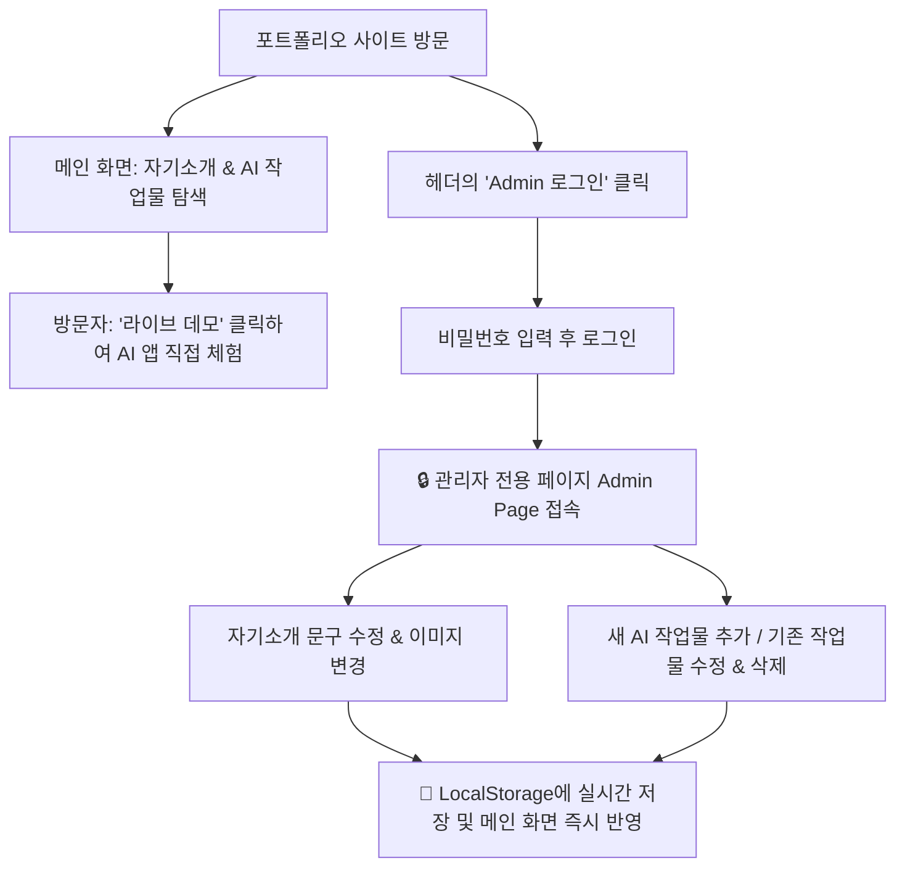

# 🚀 [PRD] 김도욱의 AI 프로젝트 포트폴리오 웹사이트 (DOWOOK AI Portfolio)

---

## 1. 문서 개요 (Overview)

| 항목 | 내용 |
| :--- | :--- |
| **프로젝트명** | 김도욱 개인 AI 프로젝트 포트폴리오 웹사이트 |
| **기획자/개발자** | 김도욱 |
| **문서 버전** | v1.1 (관리자 페이지 및 LocalStorage 스펙 추가) |
| **작성일** | 2026년 7월 27일 |
| **타겟 대상** | 20대 대학생 (주 주요 타겟: 경기도 고양시 소재 대학생, 25세 전후) |
| **핵심 목적** | 개발한 AI 기반 웹사이트 및 앱 프로젝트를 한눈에 보여주고 실시간 접속이 가능하게 함 |

---

## 2. 프로젝트 목적 및 핵심 가치 (Product Goals)

### 🎯 핵심 목적
1. **AI 프로젝트 집약체**: 직접 제작한 AI 웹/앱 서비스들을 카드 형태로 시각화하여 방문자가 바로 접속 및 체험할 수 있도록 제공.
2. **트렌디한 퍼스널 브랜딩**: AI 트렌드 리더이자 웹앱 개발자로서의 전문성과 열정을 보여주는 개인 브랜드 사이트 구축.
3. **전용 관리자 페이지(Admin Page)**: 로그인 후 관리자 전용 대시보드 페이지에서 코드를 건드리지 않고 자기소개 수정 및 작업물을 손쉽게 추가/수정/삭제.
4. **브라우저 로컬 스토리지(LocalStorage) 저장**: 데이터베이스(DB) 서버 구축 없이 브라우저 저장소를 활용하여 속도가 빠르고 독립적인 데이터 관리.
5. **네트워킹 & 소통**: 타겟 학생층이 쉽게 접근할 수 있는 오픈채팅, 이메일, Github 링크를 통해 손쉬운 커뮤니케이션 기회 마련.

---

## 3. 타겟 페르소나 및 사용자 시나리오 (Target Persona & Scenario)

### 👤 타겟 페르소나
- **이름**: 이학생 (25세, 경기도 고양시 소재 대학교 3~4학년)
- **특징**: AI 트렌드 및 최신 기술 서비스에 관심이 많음, 유용한 웹/앱을 찾아보고 직접 써보는 것을 좋아함.
- **니즈**: "김도욱 개발자가 어떤 AI 프로젝트를 만들었는지 궁금하고, 복잡한 절차 없이 클릭 한 번으로 바로 써보고 싶어!"

### 🗺️ 관리자 및 일반 유저 접근 시나리오


---

## 4. 핵심 기능 명세 (Feature Specifications)

### F-01. 헤더 및 글로벌 네비게이션 (Header & Navigation)
- **기능 설명**: 사이트 최상단에서 브랜드 로고, 주요 섹션 이동 메뉴, 관리자 접속 버튼을 제공합니다.
- **세부 구성**:
  - **로고**: `DOWOOK.AI` (클릭 시 상단으로 이동)
  - **메뉴**: `소개 (About)`, `작업물 (Projects)`, `연락처 (Contact)`
  - **관리자 접속 버튼**: `🔒 Admin Login` (로그인 상태일 때는 `🔑 Admin Page` 및 `🚪 로그아웃` 표시)
- **이용 권한**: 전체 방문자

---

### F-02. 메인 히어로 & 자기소개 섹션 (Hero & Bio Section)
- **기능 설명**: 사이트 방문 시 보이는 첫인상 섹션이자 김도욱 님의 관심 분야와 역량을 소개하는 공간입니다.
- **세부 구성**:
  - **프로필 정보**: 이름(김도욱), 헤드라인 문구, 관심 분야 태그(`#AI트렌드`, `#웹앱개발`, `#AI서비스`), 프로필 이미지.
  - **상세 소개글**: AI 분야에 대한 관심, 주요 개발 경험 및 성과 공유.
  - **동적 연동**: 관리자 페이지에서 수정된 자기소개 내용이 LocalStorage로부터 로드되어 실시간으로 표시됨.

---

### F-03. AI 작업물(프로젝트) 갤러리 섹션 (Projects Section)
- **기능 설명**: 내가 만든 AI 기반 웹사이트 및 앱을 카드로 한눈에 보여주고 접속을 유도합니다.
- **세부 구성**:
  - **카테고리 필터**: `전체` | `AI 웹사이트` | `AI 모바일앱` | `실험실/기획중`
  - **프로젝트 카드 리스트**:
    - 썸네일 이미지 (또는 AI 그래픽 배너)
    - 프로젝트 제목 & 한 줄 설명
    - 사용된 AI 기술 및 개발 스택 태그 (예: `#GPT-4o`, `#React`, `#Vite`)
    - **접속 버튼**: `[🚀 라이브 데모 바로가기]`, `[💻 Github]`
  - **동적 연동**: 관리자 페이지에서 새로 추가하거나 수정한 프로젝트 리스트가 LocalStorage로부터 자동 로드됨.

---

### F-04. 🔐 관리자 전용 페이지 (Admin Page & Auth) ⭐ [신규 추가]
- **기능 설명**: 로그인 후 접속 가능한 전용 대시보드 페이지로, 자기소개 수정 및 작업물 CRUD(추가/수정/삭제)를 통합 관리합니다.
- **상세 흐름 & 화면 구성**:
  1. **로그인 관문 (Admin Login Gate)**:
     - 비밀번호(PIN 코드) 입력 폼 제공.
     - 비밀번호 일치 시 LocalStorage에 관리자 인증 세션(`dowook_admin_session`)을 저장하고 관리자 페이지 메인으로 이동.
  2. **관리자 대시보드 메인 레이아웃 (Admin Dashboard View)**:
     - 상단: `[메인 포트폴리오로 돌아가기]` 및 `[로그아웃]` 버튼.
     - 탭 구분: `[1. 자기소개 관리]` | `[2. 작업물 목록 & 추가]` | `[3. 데이터 백업/복원]`
  3. **자기소개 수정 폼 (Bio Edit Form)**:
     - 이름, 대표 헤드라인, 프로필 이미지 URL, 태그 입력란, 상세 자기소개 텍스트상자(Textarea).
     - `[💾 자기소개 저장하기]` 버튼 클릭 시 LocalStorage(`dowook_portfolio_bio`)에 즉시 저장.
  4. **작업물 추가 및 관리 폼 (Projects Management Form)**:
     - **새 작업물 추가 (Create)**: 프로젝트 제목, 설명, 카테고리, 대표 이미지 URL, 접속 링크(Demo/Github), 사용 태그 입력 후 `[➕ 작업물 추가]` 버튼 클릭.
     - **기존 작업물 수정 (Update)**: 목록에서 카드 클릭 시 수정 모드로 전환되어 내용 변경 가능.
     - **작업물 삭제 (Delete)**: `[🗑️ 삭제]` 버튼 클릭 시 확인 알림창 출력 후 목록에서 제거.
     - 모든 변경사항은 LocalStorage(`dowook_portfolio_projects`)에 실시간 반영됨.
  5. **데이터 관리기 (Data Backup & Reset)**:
     - `[📥 JSON 데이터 백업 다운로드]`: 로컬스토리지 데이터를 파일로 내보내기.
     - `[🔄 기본 데이터로 초기화]`: 데이터 유실 시 초기 샘플 데이터로 복구.

---

### F-05. ✉️ 소셜 & 이메일 전송 연락폼 섹션 (Contact Form & Social Links) ⭐ [기능 확장]
- **기능 설명**: 방문자가 이름, 이메일 주소, 메시지를 입력하면 개발자에게 실시간 이메일이 발송되는 EmailJS 연동 연락폼과 추가 소셜 버튼 모음입니다.
- **세부 구성**:
  - **이메일 전송 연락폼 (EmailJS Contact Form)**:
    - **성함/닉네임 입력란 (`name`)**: 필수 입력 (Text Input)
    - **이메일 주소 입력란 (`email`)**: 답변 수신용 이메일 주소 형식 검증 (Email Input)
    - **메시지 내용 입력란 (`message`)**: 자유로운 문의 및 질의 내용 작성 (Textarea)
    - **🛡️ 3중 스팸 방지 시스템 (Anti-Spam Protection)**:
      1. **허니팟 봇 트랩 (Honeypot Trap)**: 숨김 필드(`website_url`)를 통해 봇 자동 제출 즉시 탐지 및 차단
      2. **🐾 고양이 스팸 방지 퀴즈 (Cat CAPTCHA Quiz)**: 난수 계산 문제 (예: `4 + 3 = ?`) 정답 입력 검증
      3. **30초 재전송 쿨타임 (Rate Limiting)**: 연속 도배 방지를 위해 전송 성공 후 30초간 재전송 제한 (`sessionStorage` 기반)
    - **이메일 보내기 버튼 (`[✉️ 이메일 보내기]`)**: 클릭 시 EmailJS SDK (`service_5imxylv` / `template_8gaj1uo`)를 통해 `hanguojindaoyu000510@gmail.com`으로 실시간 메일 전송
    - **발송 상태 피드백**: 전송 중 버튼 로딩 표시 및 전송 완료/실패 안내 메시지 출력
  - **소셜 & 보조 연락처 버튼 모음**:
    - **1:1 오픈채팅 버튼**: 클릭 시 카카오톡 오픈채팅방 연결
    - **이메일 복사 버튼**: 클릭 시 이메일 주소 클립보드 자동 복사
    - **Github 저장소 바로가기**: 내 개발 내역 및 코드를 확인할 수 있는 Github 프로필 연결

---

### F-06. 🏫 카카오맵 학교 위치 지도 섹션 & 서버 API 프록시 ⭐ [신규 추가]
- **기능 설명**: 카카오맵 API(Kakao Maps API)를 통해 개발자의 출신 학교(**한국항공대학교**) 위치를 지도로 보여주며, API 키 유출 방지를 위해 서버 API 프록시 구조로 호출합니다.
- **세부 사양**:
  - **카카오맵 인터랙티브 지도**: 학교 위치 핀 마커, 귀여운 고양이 커스텀 인포윈도우(`🐾 한국항공대학교 🐱`), 지도 확대/축소 컨트롤 내장
  - **보안 아키텍처 (Server API Proxy)**:
    - 프론트엔드에 API 키를 하드코딩하지 않고 Node.js 서버 / Vercel Serverless API (`/api/map-config`, `/api/contact-config`)를 통해 수신
    - `.gitignore` 설정을 통해 `.env` 파일의 민감 키값이 GitHub에 유출되는 것을 100% 방지
    - 안전한 오픈 템플릿인 `.env.example` 제공

---

## 5. 💾 로컬 스토리지 데이터 구조 (LocalStorage Data Schema)

서버나 외부 DB 연동 없이 브라우저 내 **LocalStorage**를 활용하여 고속으로 작동하도록 설계되었습니다.

### 5.1 Storage Key 목록
| Key 이름 | 설명 | 저장 데이터 형식 |
| :--- | :--- | :--- |
| `dowook_admin_session` | 관리자 로그인 인증 세션 상태 | `{ "isLoggedIn": true, "loginTime": 1722070000 }` |
| `dowook_portfolio_bio` | 나만 편집 가능한 자기소개 정보 | JSON Object |
| `dowook_portfolio_projects` | 등록된 작업물(AI 프로젝트) 리스트 | JSON Array |

### 5.2 저장 데이터 JSON 구조 예시
```json
{
  "dowook_portfolio_bio": {
    "name": "김도욱",
    "headline": "AI 기술로 새로운 경험을 만드는 개발자, 김도욱입니다.",
    "tags": ["AI 트렌드", "웹앱 개발", "서비스 런칭"],
    "bio": "안녕하세요! AI 트렌드를 탐구하고 가치 있는 웹/앱 서비스를 제작하는 개발자 김도욱입니다.",
    "profileImg": "./assets/profile.jpg"
  },
  "dowook_portfolio_projects": [
    {
      "id": 1722070100000,
      "title": "AI 운세 쿠키 생성기",
      "category": "AI 웹사이트",
      "description": "오늘의 운세와 격언을 AI가 생성해 주는 포춘쿠키 웹 앱",
      "tags": ["AI", "JavaScript", "HTML/CSS"],
      "demoUrl": "https://example.com/fortune",
      "githubUrl": "https://github.com/example/fortune",
      "imageUrl": "./assets/project1.jpg",
      "createdAt": "2026-07-27"
    }
  ]
}
```

---

## 6. 🎨 UI/UX 디자인 가이드라인 (Design Guidelines)

### 🎨 디자인 콘셉트: **Refreshing Mint Sky & Cute AI Cat Theme** ⭐ [테마 리뉴얼]
- **일반 모드**: 남성 개발자의 청량함과 아기자기한 감성을 동시에 충족하는 **스카이블루 & 민트 그린 고양이 AI 테마 & 소프트 글래스모피즘(Light Glassmorphism)**.
- **관리자 페이지**: 민트 테마와 통일감을 주는 깔끔하고 시원한 **파스텔 폼 대시보드(Light Mint Dashboard) 스타일** 적용.

### 🎨 컬러 팔레트
| 역할 | 컬러명 | HEX / RGBA 코드 | 느낌 |
| :--- | :--- | :--- | :--- |
| **배경색 (Background)** | Mint Cool Cream White | `#F4FAF8` | 시원하고 깨끗한 쿨 크림 화이트 |
| **카드/폼 배경 (Surface)** | Pure Light Glass | `rgba(255, 255, 255, 0.88)` | 투명하고 상큼한 쿨 민트 글래스모피즘 |
| **메인 포인트 (Primary)** | Refreshing Sky Blue | `#38BDF8` | 청량하고 선명한 스카이블루 |
| **보조 포인트 (Secondary)** | Mint Emerald Green | `#10B981` | 산뜻하고 감각적인 민트 에메랄드 그린 |
| **텍스트 (Text Primary)** | Deep Slate Charcoal | `#0F172A` | 선명하고 눈이 편안한 슬레이트 차콜 |

---

## 7. ❓ 포트폴리오 기획자의 추가 확인 & 선택 필요 사항 (Open Questions)

관리자 페이지 구현을 위해 추가로 의견을 주시면 반영하여 완성도를 더욱 높이겠습니다!

1. **관리자 페이지 접속 이동 방식:**
   * 🟢 **A안 (추천):** 메인 사이트 헤더의 `🔒 Admin` 클릭 ➔ 비밀번호 입력 ➔ 전용 관리자 화면 페이지(`/admin` 뷰)로 완전 전환
   * 🟡 **B안:** 메인 사이트 화면 상에서 레이어 모달(Modal Window)로 관리자 창이 뜨는 방식
2. **초기 비밀번호 설정 방식:**
   * 관리자 로그인 기본 비밀번호를 `1234` 또는 `admin123`으로 기본 세팅해 두고 시작하시겠습니까, 아니면 첫 접속 시 직접 설정하게 할까요?
3. **로컬 스토리지 데이터 백업 및 복원 기능:**
   * 다른 브라우저나 컴퓨터로 이동하거나 브라우저 쿠키 삭제 시 데이터가 지워질 수 있으므로, 관리자 페이지에 **`[데이터 JSON 다운로드/업로드 백업]`** 버튼을 추가해 두는 것에 대해 어떻게 생각하시나요?

---

> 💡 **Tip:** 본 마크다운 문서는 `portfolio/prd.md` 위치에 저장되었습니다.
